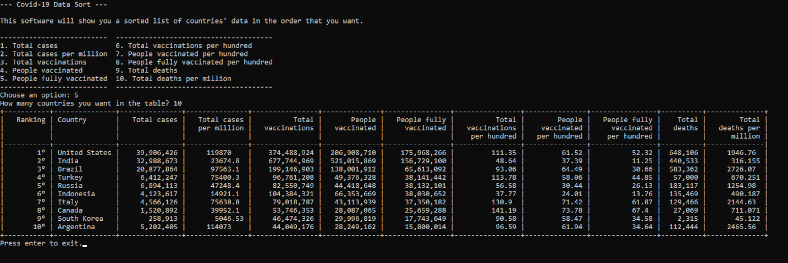

# Covid-19 Data Sort

This is a simple software made with Python that will show you a sorted list of countries' Covid-19 data in the order that you want.

The data source for this project is the Our World in Data website in the link below:

https://ourworldindata.org/covid-vaccinations

## Usage

To run this project, you will need to have installed:

`Python 3.7`

`Tabulate lib`

In the data source website you need to download the dataset in .csv file.

With the software and the dataset in hand, run the .py file, choose the data order you want and the number of countries in the table.
